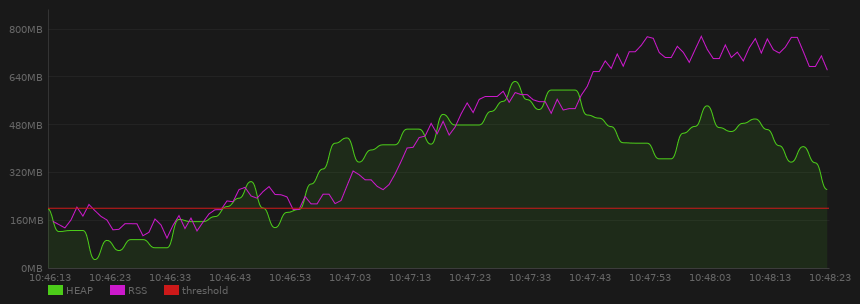

# 1.10.0

## New features

-   Introduce regions for smooth line & smooth line area from [Laurent Callarec](https://github.com/lcallarec)
-   Sliding timeline : [PR](https://github.com/lcallarec/live-chart/pull/40) from [Robert-Ordis](https://github.com/Robert-Ordis)
-   Seek, pause and resume timeline : [PR](https://github.com/lcallarec/live-chart/pull/38) from [Robert-Ordis](https://github.com/Robert-Ordis)
-   Add GTK4 support and drop GTK3 : [PR](https://github.com/lcallarec/live-chart/pull/37) from [taozuhong](https://github.com/taozuhong)

## Fixes

-   Properly remove a serie [PR](https://github.com/lcallarec/live-chart/pull/39) from [Robert-Ordis](https://github.com/Robert-Ordis)

# 1.9.1

## Fixes

-   Missing second point in line / line-area serie
-   Last point in line / line-area rendered twice
-   Left padding when auto padding is enabled and y axis has no unit
-   Crash when accessing deprecated `Chart.background.main_color` property

-   Tests can ran deprecated stuff without warnings

# 1.9.0

## New features

-   [`LiveChart.MaxBoundLine`](https://lcallarec.github.io/live-chart/Livechart/LiveChart.MaxBoundLine.html) and [`LiveChart.MinBoundLine`](https://lcallarec.github.io/live-chart/Livechart/LiveChart.MaxBoundLine.html)

Max and Min bound line renderer draws a straight line which represents either a `MIN` or a `MAX` of a given serie, or of all series.

```vala
var heap = new LiveChart.Serie("HEAP", new LiveChart.SmoothLineArea());
heap.line.color = { 0.3f, 0.8f, 0.1f, 1.0f };

var rss = new LiveChart.Serie("RSS",  new LiveChart.Line());
rss.line.color = { 0.8f, 0.1f, 0.8f, 1.0f };

var max = new LiveChart.Serie("MAX OF RSS OR HEAP", new LiveChart.MaxBoundLine());
var mrss = new LiveChart.Serie("MAX HEAP", new LiveChart.MaxBoundLine.from_serie(rss));
max.line.color = { 0.8f, 0.5f, 0.2f, 1.0f };
mrss.line.color = { 0.5f, 0f, 1.0f, 1.0f };

chart.add_serie(heap);
chart.add_serie(rss);
chart.add_serie(max);
chart.add_serie(mrss);
```

# 1.8.0

## New features

-   Add a new [`LiveChart.ThresholdLine`](https://lcallarec.github.io/live-chart/Livechart/LiveChart.ThresholdLine.html) renderer which draw a straight line at a given value.
    Below, the red threshold line is defined at 200MB :



```vala
var threshold = new LiveChart.Serie("threshold",  new LiveChart.ThresholdLine(200.0));
threshold.line.color = { 0.8f, 0.1f, 0.1f, 1.0f };
threshold.value = 250.0; // update threshold at runtime
```

-   Add serie line / outline configuration options via [`LiveChart.Serie.line`](https://lcallarec.github.io/live-chart/Livechart/LiveChart.Serie.line.html).
    Full configuration details available in [Path](https://lcallarec.github.io/live-chart/Livechart/LiveChart.Path.html) class.

```vala
serie.line.color = { 0.0f, 0.1f, 0.8f, 1.0f };
serie.line.width = 2;
serie.line.dash = Dash() {dashes = {1}, offset = 2};
serie.line.visibility = false;//or true
```

## Deprecations

-   `Renderers main_color` properties are now deprecated and will be removed in `LiveChart 2`. Use [SerieRenderer.color](https://lcallarec.github.io/live-chart/Livechart/LiveChart.SerieRenderer.color.html) property instead.
-   [Background.main_color](https://lcallarec.github.io/live-chart/Livechart/LiveChart.Background.main_color.html) property is now deprecated and will be removed in `LiveChart 2`. Use [Background.color](https://lcallarec.github.io/live-chart/Livechart/LiveChart.Background.color.html) property instead.

# 1.7.1

## New feature

-   Add a [serie.add_with_timestamp(double value, int64 timestamp)](https://lcallarec.github.io/live-chart/Livechart/LiveChart.Serie.add_with_timestamp.html) method when you need to add a value with a manually defined timstamp, in milliseconds

## Deprecations

-   [Serie.set_main_color](https://lcallarec.github.io/live-chart/Livechart/LiveChart.Serie.set_main_color.html) and [Serie.get_main_color](https://lcallarec.github.io/live-chart/Livechart/LiveChart.Serie.get_main_color.html) methods are now deprecated and will be removed in `LiveChart 2`. Use [serie.main_color](https://lcallarec.github.io/live-chart/Livechart/LiveChart.Serie.main_color.html) property instead.

# 1.7.0

## New features

-   `Series` can be retrieved using [Chart.series](https://lcallarec.github.io/live-chart/Livechart/LiveChart.Series.html) property, by index using array access notation or getter (`Chart.series[index] or Chart.series.get(int index)`), or by name (`Chart.series.get_by_name(string name)`). Adding a new value to a serie is simpler : get the serie (either from where you created it or from chart's property) and add a value with [Serie.add(double value)](https://lcallarec.github.io/live-chart/Livechart/LiveChart.Serie.add.html)

## Deprecations

-   Hence [Chart.add_value](https://lcallarec.github.io/live-chart/Livechart/LiveChart.Chart.add_value.html) and [Chart.add_value_by_index](https://lcallarec.github.io/live-chart/Livechart/LiveChart.Chart.add_value_by_index.html) methods are now deprecated and will be removed in `LiveChart 2`. Use above new methods instead.

# 1.6.1

[Contributions](https://github.com/lcallarec/live-chart/pull/19) from [https://github.com/taozuhong](taozuhong):

## Fixes

-   Compile error [https://github.com/taozuhong](taozuhong) on MSYS2

## Misc

-   Build shared library if needed

# 1.6.0

## API

-   add `chart.add_unaware_timestamp_collection_by_index(int serie_index, Gee.Collection<double?> collection, int timespan_between_value)` method, to add your own data collection to a serie given its `serie_index` (unlike `chart.add_unaware_timestamp_collection()` which takes the serie as argument)

## Fixes

-   Crash when the max value of a serie is 0
-   Crash when the chart widget is realized before any data is added

# 1.5.1

## API

-   add `chart.add_value_by_index(int serie_index, double value)` method, to add a value to a serie given its `serie_index` (unlike `chart.add_value()` which takes the serie as argument)

# 1.5.0

## New feature

-   Configure legend font

```vala
var chart = new LiveChart.Chart(config);
var legend = vhart.legend;

legend.labels.font.size = 12;                      // uint8     In pixels
legend.labels.font.color = { 1.0f, 0.0f, 0.0f, 1.0f };   // Gdk.RGBA
legend.labels.font.weight = Cairo.FontWeight.BOLD; // Cairo.FontWeight
legend.labels.font.slant =  Cairo.FontSlant.ITALIC;// Cairo.FontSlant
```

-   Configure axis labels font

```vala
var labels;

labels = config.x_axis.labels;
//or
labels = config.y_axis.labels;

labels.font.size = 12;                      // uint8     In pixels
labels.font.color = { 1.0f, 0.0f, 0.0f, 1.0f };   // Gdk.RGBA
labels.font.weight = Cairo.FontWeight.BOLD; // Cairo.FontWeight
labels.font.slant =  Cairo.FontSlant.ITALIC;// Cairo.FontSlant
```

-   Improved legend labels vertical alignement

# 1.4.0

## New feature

-   [70370e](https://github.com/lcallarec/live-chart/commit/70370e76559ee92d4feea58cd8ced0c98d9da95d) Import your own timestamp unaware data collection

# 1.3.3

## API

-   [e36b6b](https://github.com/lcallarec/live-chart/commit/e36b6b59d178d8d72316aed040cfc5fa074b7b5a) Can now retrieve underlying `Values` object from `Serie`
-   [6fc2f4](https://github.com/lcallarec/live-chart/commit/6fc2f4451879fb05a511644cc8807a3bb8de4d0f) Can now clear `Values` object from `Serie`

# 1.3.2

## New feature

-   Open LiveChart Valadoc to public

## Fixes

-   [c77e2c](https://github.com/lcallarec/live-chart/commit/c77e2cbb0dcf7d343806408f3ed52ae9090f01a3) Wrong default Path colors

## Misc

-   Improve documentation

## Internals

-   Merge source files

# 1.3.1

## Misc

-   Create Valadoc

## Internals

-   Merge source files
-   Remove obsolete Makefile

# 1.3.0

## New features

-   [8fe363](https://github.com/lcallarec/live-chart/commit/8fe363eb6aba8acfd00ae3a57108477fdda6b3a1) Configurate main axis (abscissa and ordinate lines) color, line width and dash style

## API change

-   [79e96b](https://github.com/lcallarec/live-chart/commit/79e96bf43106d489efa290f57d3575a447ece0aa) Chart config is now a public chart attribute

## Internals

-   [db7766](https://github.com/lcallarec/live-chart/commit/db7766b5b5dbf4ca0cb7ea0c9cc474d5231cd36e) Axis class type is replaced with more convenient Path class.

## Misc

-   Improve documentation

# 1.2.1

# Internal changes

-   [24258e](https://github.com/lcallarec/live-chart/commit/24258e44df775fad92aa432d26cccf9f6bc01160) Internally, structs Axis and Labels are replaced by classes
-   Improve tests

# 1.2.0

## New features

-   Configurate guidelines color, line width and dash style
-   Guidelines can be hidden independently from the whole grid
-   Main axes (abscissa and ordinate lines) can be hidden independently from the whole grid
-   Time and value labels can be hidden
-   Auto padding configuration is not `nullable`, use `LiveChart.AutoPadding.NONE` instead
-   Add license, release badges to README

# 1.1.0

## New features

-   Grid and legend can be hidden
