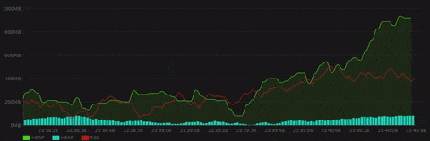
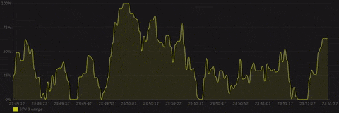
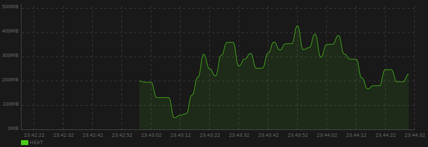
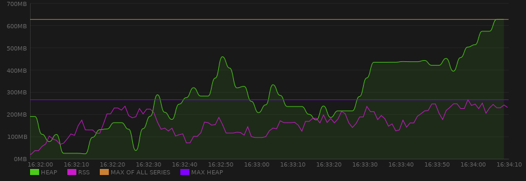

# Live Chart

 
[](https://codecov.io/gh/lcallarec/live-chart)
[](https://github.com/lcallarec/live-chart/releases)
[](https://github.com/lcallarec/live-chart/blob/master/LICENSE)

#### Live Chart is a real-time charting library for GTK4 and Vala, based on [Cairo](https://cairographics.org/).

## Features

* Live animated series (lines, smooth lines, area, bar) within a single chart
* Smart y-axis computation
* Highly configurable
* Extendable

## Screenshots

  
  
# Documentation

- [Getting started](#getting-started)
- [Dependencies](#dependencies)
- [API](#api)
- [Chart widget](#chart-widget)
- [Series](#series)
- [Serie renderer](#serie-renderers)
- [Chart configuration](#chart-configuration)
- [Background](#background)
- [Legend](#legend)
- [Chart element visibility](#chart-element-visibility)
- [Advanced usages](#advanced-usages)
- [How Livechart versions works ?](#how-livechart-versions-works)

    *N.B.: Classes and methods available in the source code and not documented here - even if they are public - are subject to change without warning in any future release*

## Getting started

Take a look at code examples :

* [General example](examples/live-chart.vala)
* [Fixed max y-axis value](examples/fixed-max.vala)
* [Hide chart elements](examples/hide-parts.vala)
* [Label configuration](examples/configure-labels.vala)
* [Static renderers](examples/static-renderer.vala)

Compile and run with :

```bash
meson build
ninja -C build
./build/examples/example
./build/examples/example-fixed-max
./build/examples/example-hide-parts
./build/examples/example-configure-labels
./build/examples/example-static-renderer
```

## Dependencies

| dependency | 
|---------|
| libgee-0.8-dev   |
| libgtk-4-dev  |

## API

[Full valadoc API documentation here](https://lcallarec.github.io/live-chart/Livechart/LiveChart.html)

## Chart widget

`Chart` widget is the main entrypoint of your live chart.

```vala  
var chart = LiveChart.Chart();
```

As `Chart` object derives from `Gtk.DrawingArea`, you can directly attach it to any `Gtk.Container` :

```vala
var window = new Gtk.Window();
window.add(chart);
```

## Series

A `Serie` is basically a structure that :

* Contains its own data set
* Has a name, like `Temperature in Paris`
* Know how it renders on the chart, i.e as `Bar`, a `Line`, a `SmoothLineArea`...

### Create and attach a **Serie**

```vala
// Serie with a default Line renderer
var serie_name = "Temperature in Paris";
var paris_temperature = new LiveChart.Serie(serie_name);

// Or inject the renderer
var serie_name = "Temperature in Paris";
var paris_temperature = new LiveChart.Serie(serie_name, new LiveChart.Bar());
```

Then register the `Serie` to the `Chart` :

```vala
var serie_name = "Temperature in Paris";
var paris_temperature = new LiveChart.Serie(serie_name);
chart.add_serie(paris);
```

The serie attached into chart is removable from the chart.
```vala
var paris_temperature = new LiveChart.Serie("Temperature in Paris");
var msm_temperature = new LiveChart.Serie("Temperature in Mont Saint-Michel")
chart.add_serie(paris_temperature);
chart.add_serie(msm_temperature);
//...
chart.remove_serie(paris_temperature);  //Remove specified serie.
chart.remove_all_series();              //Remove all series from the chart.
```

### Interacting with series

All methods of `Serie` class could be called before or after having been attached to the chart using `chart.add_serie` method, exepted for the `Renderer` and underlying data store.

Accessing a serie can be done via :

* the local reference in your code 
* the accessor methods of `chart.series` object : by index `chart.series[index] / chart.series.get(index)` or by name `chart.series.get_by_name(name)`. Beware, these methods may throw a `ChartError.SERIE_NOT_FOUND` error. 

#### Adding data points method

Please note that your `Serie` must have been registered to the `Chart` before being able to add data points to this serie.

Adding a point / value to a serie using [serie.add]((https://lcallarec.github.io/live-chart/Livechart/LiveChart.Serie.add.html) method automatically compute a timestamp stored in underlying value container.
If you need to manually compute a timestamp, in milliseconds, use [serie.add_with_timestamp(double value, int64 timestamp)](https://lcallarec.github.io/live-chart/Livechart/LiveChart.Serie.add_with_timestamp.html)

```vala
serie.add(19.5);
//or
serie.add_with_timestamp(19.5, 15978984664);
```

#### Name

```vala
serie.name = "Temperature in Paris (%s)".printf(last_value);
```

#### Visibility

You can programmatically hide / display the serie :

```vala
serie.visible = true;//or false
```

#### Lines and outlines

Lines and outlines (for bar series) can be configured with `Serie.line` property. Full configuration details available in [Path](https://lcallarec.github.io/live-chart/Livechart/LiveChart.Path.html) class.

```vala
serie.line.color = { 0.0f, 0.1f, 0.8f, 1.0f };
serie.line.width = 2;
serie.line.dash = Dash() {dashes = {1}, offset = 2};
serie.line.visibility = false;//or true
```

About color : [`Gdk.RGBA`](https://valadoc.org/gtk4/Gdk.RGBA.html) struct.
Dashes : please refer to [valadoc](https://valadoc.org/cairo/Cairo.Context.set_dash.html) and [cairo c documentation](https://www.cairographics.org/manual/cairo-cairo-t.html#cairo-set-dash)

For series with area, this impact only the outline, not the area itself.

#### Clear underlying data

Remove all data from underlying data store :

```vala
serie.clear();
```

#### Data accessor

```vala
serie.get_values();
```

### Underlying data buffer

When you add a data point to a serie, it is stored in a `LiveChart.Values` object, which derives from `Gee.LinkedList`.
To avoid your program growing too much in memory, be default, `LiveChart.Values` keeps only the last 1000 values.
You can change that behaviour by injecting manually a `LiveChart.Values` object in your serie and specify the buffer size in `Values` constructor. 

```vala
var serie_name = "Temperature in Paris";
Values values = new Values(50000); // buffer of 50 000 data points
var paris_temperature = new LiveChart.Serie(serie_name, new LiveChart.Line(values));

chart.add_serie(paris);
```

## Serie renderers

A Serie renderer is responsible of drawing data points to the chart's surface. It is passed as second argument of `Serie` constructor :

```vala
var serie_name = "Temperature in Paris";
Values values = new Values(50000); // buffer of 50 000 data points
var paris_temperature = new LiveChart.Serie(serie_name, new LiveChart.Line(values));

chart.add_serie(paris);
```

There's currently 6 built-in series available.

### Lines

* [`LiveChart.Line`](https://github.com/lcallarec/live-chart/blob/master/src/line.vala)

Line renderer connects each data point with a straight segment.


* [`LiveChart.SmoothLine`](https://github.com/lcallarec/live-chart/blob/master/src/smooth_line.vala)

Smooth line renderer connects each data point with a bezier spline for a smoother rendering.


### Lines with area

For area renderers, you can control the area color via the `area_alpha: double` property (default : 0.1):

```vala
var smooth_line = LiveChart.SmoothLineArea();
smooth_line.color = Gdk.RGBA() {red = 0.0f, green = 0.0f, blue = 1.0f, alpha = 1.0f};
smooth_line.area_alpha = 0.5;
```

The area color is not yet configurable : it's always equal to `color`.

* [`LiveChart.LineArea`](https://github.com/lcallarec/live-chart/blob/master/src/line_area.vala)


* [`LiveChart.SmoothLineArea`](https://github.com/lcallarec/live-chart/blob/master/src/smooth_line_area.vala)


### Histogram

* [`LiveChart.Bar`](https://github.com/lcallarec/live-chart/blob/master/src/bar.vala)


### Static lines

* [`LiveChart.ThresholdLine`](https://github.com/lcallarec/live-chart/blob/master/src/threshold_line.vala)

Threshold renderer draws a straight line at a given value. Below, the red threshold line is defined at 200MB :


```vala
var threshold = new LiveChart.Serie("threshold",  new LiveChart.ThresholdLine(200.0));
threshold.line.color = { 0.8f, 0.1f, 0.1f, 1.0f };
threshold.value = 250.0; // update threshold at runtime
```

* [`LiveChart.MaxBoundLine`](https://lcallarec.github.io/live-chart/Livechart/LiveChart.MaxBoundLine.html) and [`LiveChart.MinBoundLine`](https://lcallarec.github.io/live-chart/Livechart/LiveChart.MaxBoundLine.html)

Max and Min bound line renderer draws a straight line which represents either a `MIN` or a `MAX` of a given serie, or of all series. In the example below, the yellow line represents the `MAX` value of **all** series, the purple one represents the `MAX` of **HEAP**




```vala
var heap = new LiveChart.Serie("HEAP", new LiveChart.SmoothLineArea());
heap.line.color = { 0.3f, 0.8f, 0.1f, 1.0f };

var rss = new LiveChart.Serie("RSS",  new LiveChart.Line());
rss.line.color = { 0.8f, 0.1f, 0.8f, 1.0f };

var max = new LiveChart.Serie("MAX OF RSS OR HEAP", new LiveChart.MaxBoundLine());
var mrss = new LiveChart.Serie("MAX HEAP", new LiveChart.MaxBoundLine.from_serie(rss));
max.line.color = { 0.8f, 0.5f, 0.2f, 1.0f };
mrss.line.color = { 0.5f, 0f, 1.0f, 1.0f };

chart.add_serie(heap);
chart.add_serie(rss);
chart.add_serie(max);
chart.add_serie(mrss);
```

## Chart configuration

The Configuration object can be retrieved from `Chart.config` property for further adjustments :

```vala
var chart = new LiveChart.Chart();
var config = chart.config;
// Adjust the configuration
```

You can also inject the `Config` object to the chart constructor if you prefer to adjust is before chart first renderer :

```vala
var config = LiveChart.Config();
// Adjust the configuration
var chart = new LiveChart.Chart(config);
```

### Axes configuration

#### Labels (x and y axis)

Labels are the time for the x-axis and values for the y-axis.

* Axes labels visibility

```vala
var axis;

var labels;

labels = config.x_axis.labels;
//or
labels = config.y_axis.labels;

labels.visible = false;
```

* Axes label fonts

```vala
var labels;

labels = config.x_axis.labels;
//or
labels = config.y_axis.labels;

labels.font.size = 12;                      // uint8     In pixels
labels.font.color = { 1.0f, 0.0f, 0.0f, 1.0f };   // Gdk.RGBA
labels.font.weight = Cairo.FontWeight.BOLD; // Cairo.FontWeight
labels.font.slant =  Cairo.FontSlant.ITALIC;// Cairo.FontSlant
```

#### Axis lines

Axis lines are horizontal or vertical guidelines - depending on which axis they're attached - aligned on labels.


* Line color

```vala
var axis;

axis = config.x_axis;
//or
axis = config.y_axis;
axis.lines.color = Gdk.RGBA() {red = 1.0f, green = 1.0f, blue = 1.0f, alpha = 0.2f}; //Light grey
```

* Line width

```vala
var axis;

axis = config.x_axis;
//or
axis = config.y_axis;
axis.lines.width = 1.0;
```

* Line dashes

```vala
var axis;

axis = config.x_axis;
//or
axis = config.y_axis;
axis.lines.dashes = LiveChart.Dash() {dashes = {5.0}, offset = 0.0};
```

For more information about cairo dashes, please refer to [valadoc](https://valadoc.org/cairo/Cairo.Context.set_dash.html) and [cairo c documentation](https://www.cairographics.org/manual/cairo-cairo-t.html#cairo-set-dash)


* Lines visibility

```vala
var axis;

axis = config.x_axis;
//or
axis = config.y_axis;
axis.lines.visible = false;
```
#### Main axes (a.k.a x and y axis, or abscissa and ordinate)

Main axes can be configured via the `axis` attribute of each axis :

```vala
var axis_config;

axis_config = config.x_axis.axis;
//or
axis_config = config.y_axis.axis;
```

The configuration is the same than [Axis lines](#axis-lines) :


```vala
var axis_config;

axis_config = config.x_axis.axis;
//or
axis_config = config.y_axis.axis;

axis_config.color = Gdk.RGBA() {red = 1.0f, green = 1.0f, blue = 1.0f, alpha = 0.2f}; //Light grey
axis_config.width = 1.0;
axis_config.dash = LiveChart.Dash() {dashes = {5.0}, offset = 0.0};
axis_config.visible = false;
```

#### x-axis

* Tick interval (*in seconds*, default 10)

Define the time laps, in seconds, between each ticks on x-axis.

```vala
var x_axis = config.x_axis;
x_axis.tick_interval = 10; // 10 seconds between each ticks
```

The lower is the value, the faster the data points are moving from right to left.

* Tick length (*in pixels*, default 60)

Define the distance, in pixels, between each ticks on x-axis.


```vala
var x_axis = config.x_axis;
x_axis.tick_length = 60; // 60 pixels between each ticks
```

For example, with `tick_interval=10`  and `tick_length=60`, each second is displayed as 6 pixels on the chart.

* Show fraction (*bool*, default false)

Define if the timepoints on x-axis would be printed with fractional part or not.

```vala
var x_axis = config.x_axis;
x_axis.show_fraction = true; // Shows timepoint in the format: "HH:MM:SS.xxx"
```

* Slide timeline (*bool*, default false)

Define if the timeline(each of timepoints and grid line) is moving or fixed.
If true, then each timepoints has fixed value, slides along the flow of time.

```vala
var x_axis = config.x_axis;
x_axis.slide_timeline = true; // Slides the timeline like horizontal scrolling with the chart.
```

#### y-axis

* Unit

Define the unit of values displayed along y-axis. Default to empty string.

```vala
var y_axis = config.y_axis;
y_axis.unit = "%";
```

* Fixed maximum value (default null)

Sometimes, the maximum value displayed on y-axis must be fixed, for example when value is a percentage, or whenever you know the maximum possible value.

```vala
var y_axis = config.y_axis;
y_axis.unit = "%";
y_axis.fixed_max = 100.0;
y_axis.tick_interval = 25.0;
```

With this configuration, the y-axis will display 5 ticks : 0%, 25%, 50%, 75% and 100%, the maximum possible value.


Sometimes, you won't know the fixed max value. Think about the total memory available on a system. In that case, you may want to cap it a bit higher in order to keep optimal chart ventilation.
For instance, if the max value is `8.2`, you may want to ceil it to `9`, or if the max value is `859` you may want to ceil it to `900`.

For that purpose, use `LiveChart.cap` method :

```vala
var y_axis = config.y_axis;
y_axis.unit = "GB";
y_axis.fixed_max = LiveChart.cap((int) max_mem));
```

* Ratio threshold (default 1.118)

When not using `fixed_max` options, the chart drawable area is 1.118 times higher than needed to display all points. You can reduce or increase that ratio :

```vala
var y_axis = config.y_axis;
y_axis.ratio_threshold = 1.0f; // The higher point will always be on the higher part of the chart
y_axis.ratio_threshold = 2.0f; // The higher point will always be on the middle of the drawing area
```

#### Paddings

Paddings are distance between the chart window and the real drawing area where your data will be displayed.

```vala
var config = new LiveChart.Config();
var chart = new LiveChart.Chart(config);

/*
public Padding() {
    smart = AutoPadding.TOP | AutoPadding.RIGHT | AutoPadding.BOTTOM | AutoPadding.LEFT;
    top = 0;
    right = 0;
    bottom = 0;
    left = 0;
}
*/
```

#### Smart paddings

By default, because side paddings may depends on text length and font size, smart auto-padding feature is set to `AutoPadding.TOP | AutoPadding.RIGHT | AutoPadding.BOTTOM | AutoPadding.LEFT`. It means all paddings are smart computed.

Smart paddings are bit fields (a.k.a flags), so you can apply bitwise operators to combine them :

```vala
// Smart padding only for Left and Bottom paddings
config.padding.smart = LiveChart.AutoPadding.LEFT | LiveChart.AutoPadding.BOTTOM;
```

When a side isn't configured as "smart", it fallbacks to global padding settings.

To complety disable smart padding, set `config.padding.smart` to `AutoPadding.NONE` :
```vala
config.padding.smart = LiveChart.AutoPadding.LEFT | LiveChart.AutoPadding.BOTTOM;
```

#### Global paddings

Paddings can be set - in pixel - for each sides. If you need to force a padding, remember to disable the smart padding for this side.

```vala
// Remove AutoPadding.TOP from smart padding before setting a custom padding.top value
config.padding.smart = LiveChart.AutoPadding.RIGHT | LiveChart.AutoPadding.BOTTOM | LiveChart.AutoPadding.LEFT;
config.padding.top = 10; // in pixels
```
## Background

Chart has a default colored background that can be changed via the `Background.color` property :

```vala
var chart = new LiveChart.Chart();
chart.background.color = Gdk.RGBA() {red = 1.0f, green = 1.0f, blue = 1.0f, alpha = 1.0f}; //White background
```

## Legend

* Visibility

```vala
var chart = new LiveChart.Chart(config);

chart.legend.visible = false; // Hide legend
```

* Legend font

```vala
var chart = new LiveChart.Chart(config);
var legend = vhart.legend;

legend.labels.font.size = 12;                      // uint8     In pixels
legend.labels.font.color = { 1.0f, 0.0f, 0.0f, 1.0f };   // Gdk.RGBA
legend.labels.font.weight = Cairo.FontWeight.BOLD; // Cairo.FontWeight
legend.labels.font.slant =  Cairo.FontSlant.ITALIC;// Cairo.FontSlant
```

## Chart element visibility

You can prevent all chart parts from being displayed, by using the `visible` property of each part.

```vala
var config = new LiveChart.Config();

var chart = new LiveChart.Chart(config);
chart.legend.visible = false; //Hide legend
chart.grid.visible = false;   //Hide grid
```

If you want to get rid of chart padding, remember to disable `smart` paddings and set all paddings to `0`.

```vala
var config = new LiveChart.Config();
config.padding = LiveChart.Padding() { smart = LiveChart.AutoPadding.NONE, top = 0, right = 0, bottom = 0, left = 0};
```


In order to hide labels only, refer to [axis labels](#labels-x-and-y-axis)

* Axes visibility

```vala
var axis;

axis = config.x_axis;
//or
axis = config.y_axis;
axis.axis.visible = false;
```

* Both axes & labels visibility

```vala
var axis;

axis = config.x_axis;
//or
axis = config.y_axis;
axis.visible = false;
```

## Advanced usages

### Programmatic export

You can export your chart in `PNG` format :

```vala
var filename = "chart_export.png";
chart.to_png(filename);
```

### Controlling refresh rate

By default, the chart is refreshed every `100ms` and very time a new data point is added.
If it doesn't fit your needs, you can adjust the refresh rate. The lower, the smoother.

(Extra)You can also control the scrolling ratio with 2nd arg (default is 1.0).

```vala  
var chart = LiveChart.Chart();
chart.refresh_every(-1); // means to stop auto-refresh.
chart.refresh_every(1000); // refresh every 1000ms
chart.refresh_every(100, 0.0); // refresh every 100ms, and pausing
```

### Seeking on the timeline.

If you want to watch the past data, then you can specify the time which you want to seek.
Time is represented in unixtime milliseconds in default.

```vala  
var chart = LiveChart.Chart();
var conv_usec = chart.config.time.conv_us;
chart.config.time.current -= 5000; // Go 5 seconds back.
chart.config.time.current = GLib.get_real_time() / conv_usec; // Go to System's local time.
```

### Specify the range of the timeline.

In default, timestamp is treated in milliseconds.
But if you want to treat timestamp in microseconds or seconds,
then you can call `config.time.set_range` in the first to use other the range in your app.

(Warning!) If you switched to other range from "m"(milliseconds), you cannot push values with `Serie.add(double value)`.

```vala
var chart = LiveChart.Chart();
var serie = new LiveChart.Serie("USEC VALS",  new LiveChart.Line());
chart.config.time.set_range("u"); //"u" means microseconds. "m" means milliseconds. "s" to seconds.
chart.add_serie(serie);
serie.add_with_timestamp(100.0, GLib.get_real_time() / chart.config.time.conv_us); //serie.add(val) is only usable in millisecs.
```

### Deal with your own data

LiveChart uses custom [Value](https://lcallarec.github.io/live-chart/Livechart/LiveChart.TimestampedValue.html) struct to store recorded values.
Basically, it stores the value, as a double, and a timestamp.
If you use to store in a `Gee.Collection<double?>`, without any timestamp information - most of the time because you know the interval between each points - and need to import them in a LiveChart, don't panic, there's a solution. 

Use `Chart.add_unaware_timestamp_collection()` or `Chart.add_unaware_timestamp_collection_by_index()`:

```vala
// Your own dataset
var unaware_timestamp_collection = new Gee.ArrayList<double?>();
unaware_timestamp_collection.add(5);
unaware_timestamp_collection.add(10);
unaware_timestamp_collection.add(15);

var chart = new LiveChart.Chart();
var serie = new LiveChart.Serie("CPU usage");

//Potentially, you may want to clean up the existing data
serie.clear();

//You know that, in your own model, there's 2000ms between each of your points
var timespan_between_value = 2000;

chart.add_unaware_timestamp_collection(serie, unaware_timestamp_collection, timespan_between_value);
//or
chart.add_unaware_timestamp_collection_by_index(0, unaware_timestamp_collection, timespan_between_value);
```

Et voilà !

## CAUTIONS

### Removing LiveChart.Chart from Gtk.Widget

Removing LiveChart.Chart from Gtk.Widget without stopping auto-refresh causes memory leak.

```vala
var window = new Gtk.Window();
var chart = new LiveChart.Chart();
window.add(chart);

//...
chart.refresh_every(-1);  //Don't forget to stop auto-refresh if your app replaces the LiveChart.Chart widget.
window.remove(chart);

```

## How LiveChart versions works ?

* For each new feature, the `minor` version number will be bumped
* For each bug fix, small improvement or documentation update, the `patch` version number will be bumped

We'll do our best to never break the API on `minor` and `patch` updates. If we do it, it's not intentional so don't hesitate to open an issue !

Some classes, structs, methods, attributes or property will be marked as `Deprecated`, please check the compiler warnings about them. All the stuff marked as `Deprecated` will be removed from Livechart `2.0.0`, one day...

