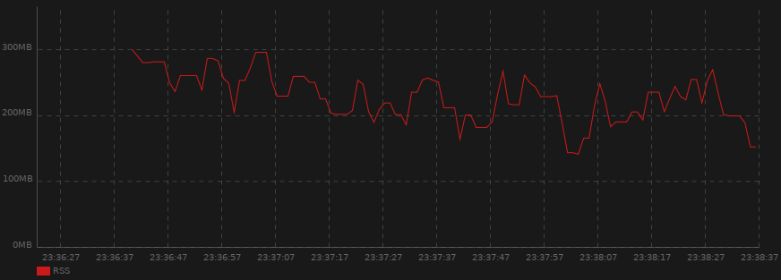
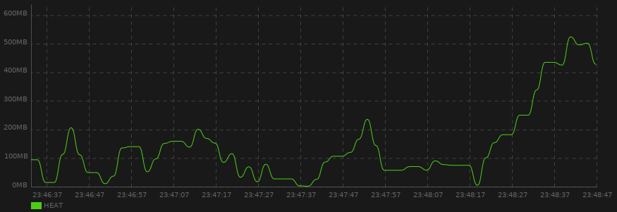
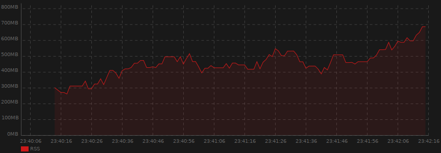

# Live Chart

 
[](https://codecov.io/gh/lcallarec/live-chart)
[](https://github.com/lcallarec/live-chart/releases)
[](https://github.com/lcallarec/live-chart/blob/master/LICENSE)

#### Live Chart is a real-time charting library for GTK3 and Vala, based on [Cairo](https://cairographics.org/).

## Features

* Render many series (lines, smooth lines, area, bar) within a single chart
* Smart y-axis computation
* Highly configurable
* Extendable

## Screenshots

  
  
# Documentation
 
*N.B.: Classes and methods available in the source code and not documented here - even if they are public - are subject to changes in a future release*

- [Getting started](#getting-started)
- [Dependencies](#dependencies)
- [API](#api)
- [Chart widget](#chart-widget)
- [Series](#series)
- [Serie renderer](#serie-renderer)
- [Chart configuration](#chart-configuration)
- [Background](#background)
- [Hidding chart parts](#hidding-chart-parts)
- [Programmatic export](#programmatic-export)
- [How Livechart versions works ?](#how-livechart-versions-works)

## Getting started

Take a look at code examples :

* [General example](examples/live-chart.vala)
* [Fixed max y-axis value](examples/fixed-max.vala)
* [Hide parts](examples/hide-parts.vala)

Compile and run with :

```bash
meson build
ninja -C build
./build/examples/example
./build/examples/example-fixed-max
./build/examples/example-hide-parts
```

## Dependencies

| dependency | 
|---------|
| libgee-0.8-dev   |
| libgtk-3-dev  |

## API

[Full API documentation here](https://lcallarec.github.io/live-chart/Livechart/LiveChart.html)

## Chart widget

`Chart` widget is the main entrypoint of lour live-chart.

```vala  
var chart = LiveChart.Chart();
```

As `Chart` object derives from `Gtk.DrawingArea`, you need to attach it to a `Gtk.Container` :

```vala
var window = new Gtk.Window();
window.add(chart);
```
### Controlling refresh rate

By default, the chart is rendered every `100ms` or very time a new data point is added.
If it doesn't fit your needs, you can adjust the rate. The lower, the smoother.

```vala  
var chart = LiveChart.Chart();
vhart.refresh_every(1000); // refresh every 1000ms
```

## Series

A `Serie` is basically a structure that :

* Contains its own data set
* Has a name, like `Temperature in Paris`
* Know how it renders on the chart, i.e `Bar`, `Line`, `SmoothLineArea`...

### Create a serie

```vala
// Serie with a default Line renderer
var serie_name = "Temperature in Paris";
var paris_temperature = new LiveChart.Serie(serie_name);

// Or inject the renderer
var serie_name = "Temperature in Paris";
var paris_temperature = new LiveChart.Serie(serie_name, new LiveChart.Bar());
```

Then register the `Serie` to the `Chart` :

```vala
var serie_name = "Temperature in Paris";
var paris_temperature = new LiveChart.Serie(serie_name);
chart.add_serie(paris);
```

The serie name can be adjusted after initalization, for example if the y-axis unit changes during runtime or if you want to display the last value for this serie :

```vala
var serie_name = "Temperature in Paris (°C)";
var paris_temperature = new LiveChart.Serie(serie_name);
chart.add_serie(paris);

paris_temperature.name = "Temperature in Paris (°F)";
//
paris_temperature.name = "Temperature in Paris (%s)".printf(last_value);
```

### Adding data points

Your `Serie` must have been registererd to the `Chart` before being able to add data points to this serie. 

```vala
var serie_name = "Temperature in Paris";
var paris_temperature = new LiveChart.Serie(serie_name);

chart.add_serie(paris);

chart.add_value(paris_temperature, 19.5);
```

### Datapoint buffer

When you add a data point to a serie, data are stored in a `LiveChart.Values` object, which is nothing more than a wrapper around a `Gee.LinkedList`.
To avoid your program growing too much in memory, be default, `LiveChart.Values` keeps only the last 1000 values.
You can change that behaviour by injecting manually a `LiveChart.Values` object in your serie and specify the buffer size in `Values` constructor. 

```vala
var serie_name = "Temperature in Paris";
Values values = new Values(50000); // buffer of 50 000 data points
var paris_temperature = new LiveChart.Serie(serie_name, new LiveChart.Line(values));

chart.add_serie(paris);
```

## Serie renderer

There's currently 5 built-in series available:

### Line serie: [`LiveChart.Line`](https://github.com/lcallarec/live-chart/blob/master/src/line.vala)


Line serie connect each data point with a straight segment.

### SmoothLine serie: [`LiveChart.SmoothLine`](https://github.com/lcallarec/live-chart/blob/master/src/smooth_line.vala)


Smooth line serie connect each data point with a bezier spline for a smoother rendering.

### Bar serie: [`LiveChart.Bar`](https://github.com/lcallarec/live-chart/blob/master/src/line.vala)


### LineArea seris: [`LiveChart.LineArea`](https://github.com/lcallarec/live-chart/blob/master/src/line_area.vala)


### SmoothLineArea serie: [`LiveChart.LineArea`](https://github.com/lcallarec/live-chart/blob/master/src/smooth_line_area.vala)


### Serie renderer API

For all series, you can control the line or the bar color via the `main_color: Gdk.RGBA` property:

```vala
var smooth_line = LiveChart.SmoothLine();
smooth_line.main_color = Gdk.RGBA() {red = 0, green = 0, blue = 1, alpha = 1}; // Pure blue
```

For area series only, you can control the area color via the `area_alpha: double` property (default : 0.1):

```vala
var smooth_line = LiveChart.SmoothLineArea();
smooth_line.main_color = Gdk.RGBA() {red = 0, green = 0, blue = 1, alpha = 1};
smooth_line.area_alpha = 0.5;
```

The area color is always the same as `main_color` value.

### Conveniant methods on `Serie`

* Main color [`Gdk.RGBA`](https://valadoc.org/gdk-3.0/Gdk.RGBA.html)

Give back the main color to the underlying renderer.

```vala
var serie_name = "Temperature in Paris";
var paris_temperature = new LiveChart.Serie(serie_name, LiveChart.SmoothLineArea());

paris_temperature.set_main_color({ 0.0, 0.1, 0.8, 1.0});
```

is the same thing than :

```vala
var renderer = LiveChart.SmoothLineArea();
var serie_name = "Temperature in Paris";
var paris_temperature = new LiveChart.Serie(serie_name, renderer);

renderer.main_color = Gdk.RGBA() {red = 0, green = 0.1, blue = 0.8, alpha = 1};;
```

## Chart configuration

The Configuration object can be retrieved from `Chart.config` property for further adjustments :

```vala
var chart = new LiveChart.Chart();
var config = chart.config;
// Adjust the configuration
```

You can also inject the `Config` object to the chart constructor if you prefer to adjust is before chart first renderer :

```vala
var config = LiveChart.Config();
// Adjust the configuration
var chart = new LiveChart.Chart(config);
```

### Axes configuration

#### Labels (x and y axis)

Labels are the time for the x-axis and values for the y-axis.

* Hidding axes labels

```vala
var axis;

axis = config.x_axis;
//or
axis = config.y_axis;
axis.labels.visible = false;
```

#### Axis lines

Axis lines are horizontal or vertical guidelines - depending on which axis they're attached - aligned on labels.


* Line color

```vala
var axis;

axis = config.x_axis;
//or
axis = config.y_axis;
axis.lines.color = Gdk.RGBA() {red = 1, green = 1, blue = 1, alpha = 0.2}; //Light grey
```

* Line width

```vala
var axis;

axis = config.x_axis;
//or
axis = config.y_axis;
axis.lines.width = 1.0;
```

* Line dashes

```vala
var axis;

axis = config.x_axis;
//or
axis = config.y_axis;
axis.lines.dashes = LiveChart.Dash() {dashes = {5.0}, offset = 0.0};
```

For more information about cairo dashes, please refer to [valadoc](https://valadoc.org/cairo/Cairo.Context.set_dash.html) and [cairo c documentation](https://www.cairographics.org/manual/cairo-cairo-t.html#cairo-set-dash)


* Hidding lines

```vala
var axis;

axis = config.x_axis;
//or
axis = config.y_axis;
axis.lines.visible = false;
```
#### Main axes (a.k.a x and y axis, or abscissa and ordinate)

Main axes can be configured via the `axis` attribute of each axis :

```vala
var axis_config;

axis_config = config.x_axis.axis;
//or
axis_config = config.y_axis.axis;
```

The configuration is the same than [Axis lines](#axis-lines) :


```vala
var axis_config;

axis_config = config.x_axis.axis;
//or
axis_config = config.y_axis.axis;

axis_config.color = Gdk.RGBA() {red = 1, green = 1, blue = 1, alpha = 0.2}; //Light grey
axis_config.lines.width = 1.0;
axis_config.lines.dashes = LiveChart.Dash() {dashes = {5.0}, offset = 0.0};
axis_config.visible = false;
```

#### x-axis

* Tick interval (*in seconds*, default 10)

Define the time laps, in seconds, between each ticks on x-axis.

```vala
var x_axis = config.x_axis;
x_axis.tick_interval = 10; // 10 seconds between each ticks
```

The lower is the value, the faster the data points are moving from right to left.

* Tick length (*in pixels*, default 60)

Define the distance, in pixels, between each ticks on x-axis.


```vala
var x_axis = config.x_axis;
x_axis.tick_length = 60; // 60 pixels between each ticks
```

For example, with `tick_interval=10`  and `tick_length=60`, each second is displayed as 6 pixels on the chart.

#### y-axis

* Unit

Define the unit of values displayed along y-axis. Default to empty string.

```vala
var y_axis = config.y_axis;
y_axis.unit = "%";
```

* Fixed maximum value (default null)

Sometimes, the maximum value displayed on y-axis must be fixed, for example when value is a percentage, or whenever you know the maximum possible value.

```vala
var y_axis = config.y_axis;
y_axis.unit = "%";
y_axis.fixed_max = 100.0;
y_axis.tick_interval = 25.0;
```

With this configuration, the y-axis will display 5 ticks : 0%, 25%, 50%, 75% and 100%, the maximum possible value.


Sometimes, you won't know the fixed max value. Think about the total memory available on a system. In that case, you may want to cap it a bit higher in order to keep optimal chart ventilation.
For instance, if the max value is `8.2`, you may want to ceil it to `9`, or if the max value is `859` you may want to ceil it to `900`.

For that purpose, use `LiveChart.cap` method :

```vala
var y_axis = config.y_axis;
y_axis.unit = "GB";
y_axis.fixed_max = LiveChart.cap((int) max_mem));
```

* Ratio threshold (default 1.118)

When not using `fixed_max` options, the chart drawable area is 1.118 times higher than needed to display all points. You can reduce or increase that ratio :

```vala
var y_axis = config.y_axis;
y_axis.ratio_threshold = 1.0f; // The higher point will always be on the higher part of the chart
y_axis.ratio_threshold = 2.0f; // The higher point will always be on the middle of the drawing area
```

#### Paddings

Paddings are distance between the chart window and the real drawing area where your data will be displayed.

```vala
var config = new LiveChart.Config();
var chart = new LiveChart.Chart(config);

/*
public Padding() {
    smart = AutoPadding.TOP | AutoPadding.RIGHT | AutoPadding.BOTTOM | AutoPadding.LEFT;
    top = 0;
    right = 0;
    bottom = 0;
    left = 0;
}
*/
```

#### Smart paddings

By default, because side paddings may depends on text length and font size, smart auto-padding feature is set to `AutoPadding.TOP | AutoPadding.RIGHT | AutoPadding.BOTTOM | AutoPadding.LEFT`. It means all paddings are smart computed.

Smart paddings are bit fields (a.k.a flags), so you can apply bitwise operators to combine them :

```vala
// Smart padding only for Left and Bottom paddings
config.padding.smart = LiveChart.AutoPadding.LEFT | LiveChart.AutoPadding.BOTTOM;
```

When a side isn't configured as "smart", it fallbacks to global padding settings.

To complety disable smart padding, set `config.padding.smart` to `AutoPadding.NONE` :
```vala
config.padding.smart = LiveChart.AutoPadding.LEFT | LiveChart.AutoPadding.BOTTOM;
```

#### Global paddings

Paddings can be set - in pixel - for each sides. If you need to force a padding, remember to disable the smart padding for this side.

```vala
// Remove AutoPadding.TOP from smart padding before setting a custom padding.top value
config.padding.smart = LiveChart.AutoPadding.RIGHT | LiveChart.AutoPadding.BOTTOM | LiveChart.AutoPadding.LEFT;
config.padding.top = 10; // in pixels
```
## Background

Chart has a default colored background that can be changed via the `Background.main_color` attribute :

```vala
var chart = new LiveChart.Chart();
chart.background.main_color = Gdk.RGBA() {red = 1, green = 1, blue = 1, alpha = 1}; //White background
```

## Hidding chart parts

You can prevent all chart parts from being displayed, by using the `visible` property of each part.

```vala
var config = new LiveChart.Config();

var chart = new LiveChart.Chart(config);
chart.legend.visible = false; //Hidding legend
chart.grid.visible = false;   //Hidding grid
```

You can also programmatically hide series :

```vala
var paris_temperature = new LiveChart.Serie("CPU usage", new LiveChart.LineArea());

paris_temperature.visible = false;
```

If you want to get rid of chart padding, remember to disable `smart` paddings and set all paddings to `0`.

```vala
var config = new LiveChart.Config();
config.padding = LiveChart.Padding() { smart = LiveChart.AutoPadding.NONE, top = 0, right = 0, bottom = 0, left = 0};
```


For hidden labels only, refer to [axis labels](#labels-x-and-y-axis)

* Hidding axes

```vala
var axis;

axis = config.x_axis;
//or
axis = config.y_axis;
axis.axis.visible = false;
```

* Hidding both axes & labels

```vala
var axis;

axis = config.x_axis;
//or
axis = config.y_axis;
axis.visible = false;
```

## Programmatic export

You can export your chart in `PNG` format :

```vala
var filename = "chart_export.png";
chart.to_png(filename);
```

## How Livechart versions works ?

* For each new feature, the `minor` version number will be bumped
* For each bug fix, small improvement or documentation update, the `patch` version number will be bumped

We'll do our best to never break the API on `minor` and `path` updates. If we do it, it's not intentionnal so don't hesitate to open an issue !

Some classes, structs, methods, attributes or property will be marked as `Deprecated`, please check the compiler warnings about them. All the stuff marked as `Deprecated` will be removed from Livechart `2.0.0`, one day...

