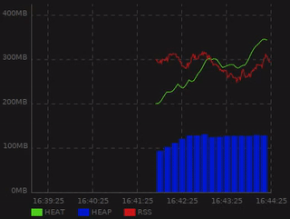
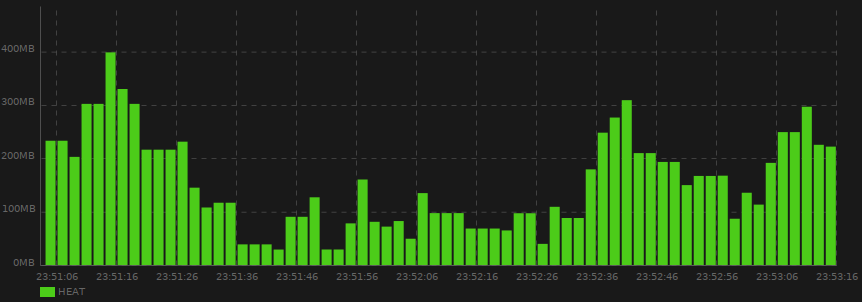
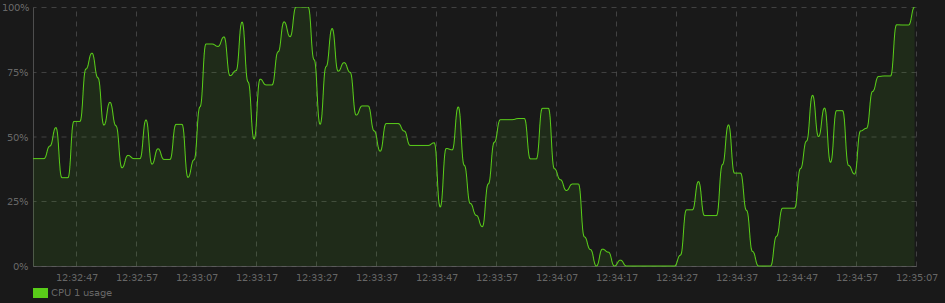

# Live Chart

## 1.0.0-beta7 (API freezed)

**Live Chart** is a real-time charting library for GTK3 and Vala, based on [Cairo](https://cairographics.org/).

## Features

* Render many series withing a single chart
* Automatic y-axis adjustement
* Support chart area / window live resizing
* Extendable

## Screenshots

  
  
## API
 
*N.B.: Classes and methods available in the source code and not documented here - even if they are public - are subject to changes in a future release*

### Chart

```vala  
var chart = LiveChart.Chart();
```

As `Chart` object derives from `Gtk.DrawingArea`, don't forget to attach it to a `Gtk.Container` :

```vala
var window = new Gtk.Window();
window.add(chart);
```

#### Refresh rate

By default, the chart is rendered every `100ms`.
If it doesn't fit your needs, you can adjust the rate :

```vala  
var chart = LiveChart.Chart();
vhart.refresh_every(1000); // refresh every 1000ms
```

### Series

A `Serie` is basically a structure that :

* Contains its own data set
* Has a name, like `Temperature in Paris`
* Know how it renders on the chart, like in `Bar`, `Line`...

#### Create a serie

```vala
// Serie with a default Line renderer
var serie_name = "Temperature in Paris";
var paris_temperature = new LiveChart.Serie(serie_name);

// Or inject the renderer
var serie_name = "Temperature in Paris";
var paris_temperature = new LiveChart.Serie(serie_name, new LiveChart.Bar());
```

Then register the `Serie` to the `Chart` :

```vala
var serie_name = "Temperature in Paris";
var paris_temperature = new LiveChart.Serie(serie_name);
chart.add_serie(paris);
```

The serie name can be adjusted after initalization, for example if the y-axis unit changes during runtime or if you want to display the last value for this serie :

```vala
var serie_name = "Temperature in Paris (°C)";
var paris_temperature = new LiveChart.Serie(serie_name);
chart.add_serie(paris);

paris_temperature.name = "Temperature in Paris (°F)";
//
paris_temperature.name = "Temperature in Paris (%s)".printf(last_value);
```

#### Adding data points

Your `Serie` must have been registererd to the `Chart` before being able to add data points to this serie. 

```vala
var serie_name = "Temperature in Paris";
var paris_temperature = new LiveChart.Serie(serie_name);

chart.add_serie(paris);

chart.add_value(paris_temperature, 19.5);
```

#### Datapoint buffer

When you add a data point to a serie, data are stored in a `LiveChart.Values` object, which is nothing more than a wrapper around a `Gee.LinkedList`.
To avoid your program growing too much in memory, be default, `LiveChart.Values` keeps only the last 1000 values.
You can change that behaviour by injecting manually a `LiveChart.Values` object in your serie. 

```vala
var serie_name = "Temperature in Paris";
Values values = new Values(50000); // buffer of 50 000 data points
var paris_temperature = new LiveChart.Serie(serie_name, new LiceChart.Line(values));

chart.add_serie(paris);
```

### Serie renderer

There's currently 5 built-in series available:

#### Line serie: [`LiveChart.Line`](https://github.com/lcallarec/live-chart/blob/master/src/line.vala)


Line serie connect each data point with a straight segment.

#### SmoothLine serie: [`LiveChart.SmoothLine`](https://github.com/lcallarec/live-chart/blob/master/src/smooth_line.vala)


Smooth line serie connect each data point with a bezier spline for a smoother rendering.

#### Bar serie: [`LiveChart.Bar`](https://github.com/lcallarec/live-chart/blob/master/src/line.vala)


#### LineArea seris: [`LiveChart.LineArea`](https://github.com/lcallarec/live-chart/blob/master/src/line_area.vala)


#### SmoothLineArea serie: [`LiveChart.LineArea`](https://github.com/lcallarec/live-chart/blob/master/src/smooth_line_area.vala)


#### Serie renderer API

For all series, you can control the line or the bar color via the `main_color: Gdk.RGBA` property:

```vala
var smooth_line = LiveChart.SmoothLine();
smooth_line.main_color = Gdk.RGBA() {red: 0, green: 0, blue: 1, alpha: 1}; // Pure blue
```

For area series, you can control the area color via the `area_alpha: double` property (default : 0.1):

```vala
var smooth_line = LiveChart.SmoothLineArea();
smooth_line.main_color = Gdk.RGBA() {red: 0, green: 0, blue: 1, alpha: 1};
smooth_line.area_alpha = 0.5;
```

The area color is always the same as `main_color` value.


#### Configure a renderer

* Main color [`Gdk.RGBA`](https://valadoc.org/gdk-3.0/Gdk.RGBA.html)

Conveniant method. Give back the main color to the underlying renderer.

```vala
var serie_name = "Temperature in Paris";
var paris_temperature = new LiveChart.Serie(serie_name);

paris_temperature.set_main_color({ 0.0, 0.1, 0.8, 1.0});
```

### Global chart configuration

Configuration object is injected in `Chart` class constructor :

```vala
var config = new LiveChart.Config();
var chart = new LiveChart.Chart(config);
```

#### Axis configuration

##### x-axis

* Tick interval (*in seconds*, default 10)

Define the time laps, in seconds, between each ticks on x-axis.

```vala
var x_axis = config.x_axis;
x_axis.tick_interval = 10; // 10 seconds between each ticks
```

* Tick length (*in pixels*, default 60)

Define the distance, in pixels, between each ticks on x-axis.


```vala
var x_axis = config.x_axis;
x_axis.tick_length = 60; // 60 pixels between each ticks
```

For example, with `tick_interval=10`  and `tick_length=60`, each second is displayed as 6 pixels on the chart.

##### y-axis

* Tick interval (*in unit*, default 60)

Define the value gap (in unit) between each ticks on y-axis.

```vala
var y_axis = config.y_axis;
y_axis.tick_interval = 60; // 60 units
```

* Unit

Define the unit of values displayed along y-axis. Default to empty string.

```vala
var y_axis = config.y_axis;
y_axis.unit = "%";
```

* Fixed maximum value (default null)

Sometimes, the maximum value displayed on y-axis must be fixed, for example when value is a percentage, or whenever you know the maximum possible value.

```vala
var y_axis = config.y_axis;
y_axis.unit = "%";
y_axis.fixed_max = 100.0;
y_axis.tick_interval = 25.0;
```

Sometimes, you won't know the fixed max value. Think about the total memory available a system. In that case, you may want to cap it a bit higher in order to keep optimal chart ventilation.
For instance, if the max value is `8.2`, you may want to ceil it to `9`, or if the max value is `859` you may want to ceil it to `900`.

For that purpose, use `LiveChart.cap` method :

```vala
var y_axis = config.y_axis;
y_axis.unit = "GB";
y_axis.fixed_max = LiveChart.ceil((int) max_mem));
```



With this configuration, the y-axis will display 5 ticks : 0%, 25%, 50%, 75% and 100%, the maximum possible value.

##### Paddings

Paddings are distance between the chart window and the real drawing area where your data will be displayed.

```vala
var config = new LiveChart.Config();
var chart = new LiveChart.Chart(config);

/*
public Padding() {
    smart = AutoPadding.TOP | AutoPadding.RIGHT | AutoPadding.BOTTOM | AutoPadding.LEFT;
    top = 0;
    right = 0;
    bottom = 0;
    left = 0;
}
*/
```

##### Smart paddings

By default, because side paddings may depends on text length and font size, smart auto-padding feature is set to `AutoPadding.TOP | AutoPadding.RIGHT | AutoPadding.BOTTOM | AutoPadding.LEFT`. It means all paddings are smart computed.

Smart paddings are bit fields (a.k.a flags), so you can apply bitwise operators to combine them :

```vala
// Smart padding only for Left and Bottom paddings
config.padding.smart = LiveChart.AutoPadding.LEFT | LiveChart.AutoPadding.BOTTOM;
```

When a side isn't configured as "smart", it fallbacks to global padding settings.

##### Global paddings

Paddings can be set - in pixel - for each sides. If you need to force a padding, remember to disable the smart padding for this side.

```vala
// Remove AutoPadding.TOP from smart padding before setting a custom padding.top value
config.padding.smart = AutoPadding.RIGHT | AutoPadding.BOTTOM | AutoPadding.LEFT;
config.padding.top = 10; // in pixels
```
### Background

Chart has a default colored background that can be changed via the `Background.main_color` attribute :

```vala
var chart = new LiveChart.Chart();
chart.background.main_color = Gdk.RGBA() {red: 1, green: 1, blue: 1, alpha: 1}; //White background
```

### Programmatic export

You can export your chart in `PNG` format :

```vala
var filename = "chart_export.png";
chart.to_png(filename);
```

## Examples

Example source code

* [General example](examples/live-chart.vala)
* [Fixed max y-axis value](examples/fixed-max.vala)

Compile and run with :

```bash
meson build
ninja -C build
./build/examples/example
./build/examples/example-fixed-max
```

## Dependencies

| dependency | 
|---------|
| libcairo2-dev   |
| libgee-0.8-dev   |
| libgtk-3-dev  |
