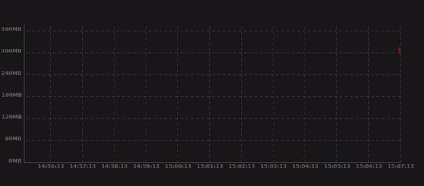
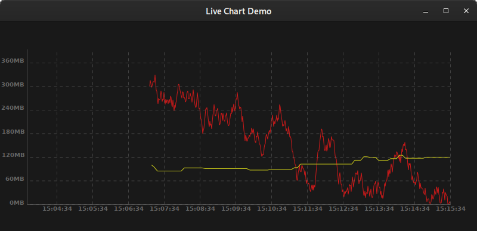

# Live Chart

**Live Chart** is a real-time charting library for GTK3 and Vala, based on [Cairo](https://cairographics.org/).

## Features

Live chart, as its name imply, aims to render real-time series.

* Render many series withing a single chart
* Automatic y-axis adjustement
* Support chart area / window live resizing
* Extendable

## Screenshots




## Example 

Example source code available [here](examples/live-chart.vala)

Compile and run with (you need to have cario-dev installed)

```bash
$ make
```

## Dependencies

| dependency | 
|---------|
| libcairo2-dev   |
| libgee-0.8-dev   |
| libgtk-3-dev  |
